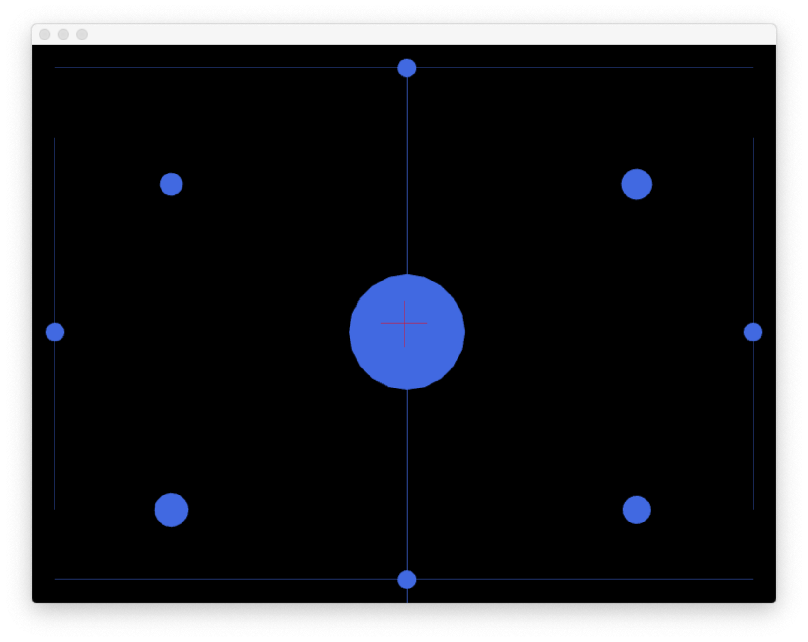

# TestOfxBalanceBoard

This repository contains a test program for the open frameworks module ofxBalanceBoard.

## Requirements

 * [open frameworks](https://openframeworks.cc)
 * ofxNetwork
 * ofxOsc
 * [OSCulator](https://osculator.net)

## Setup

Use the projectGenerator in the open frameworks folder to update this project and create a project file for your platform (win,unix).

## Usage

Connect a WiiFit balance board via Bluetooth to your computer and forward the incoming messages using OSCulator.
Set EventType to OSCmessage and create a new Value. Under Targets click on the settings symbol in the highlighted line and select localhost:9000.
Run testOfxBalanceBoard. You should see something like this:

